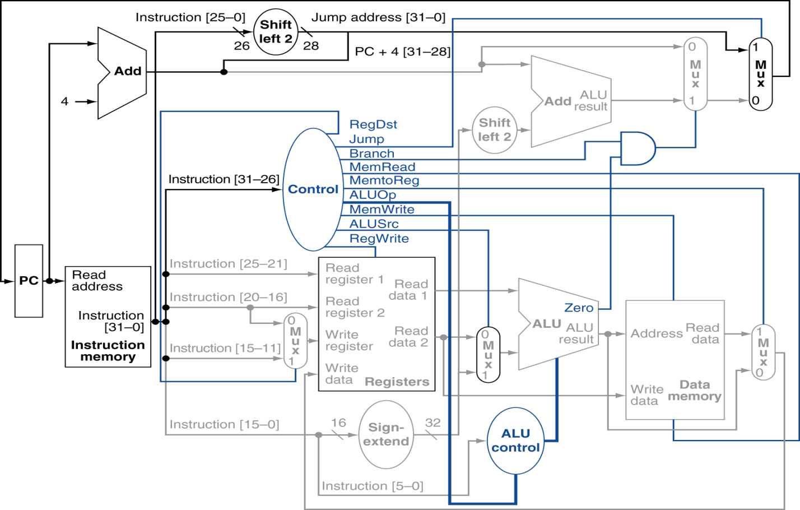

# MIPS-Single-Cycle-Processor

## Description
This project is a simulation of a single-cycled processor based on the MIPS architecture. The processor was written using Verilog and simulated using Vivado 2018.1; it supports a limited instruction set including load, store, branch, jump, and R-type instructions. More supported instructions and overflow handling are planned additions for the future.

**_The below figure gives an overview of the datapath used in the processor._**

## Current Supported Instructions
+ `lw`
+ `add`
+ `sub`
+ `mult`
+ `div`
+ `j`
+ `slt`
+ `beq`
+ `and`
+ `or`
+ `xor`
